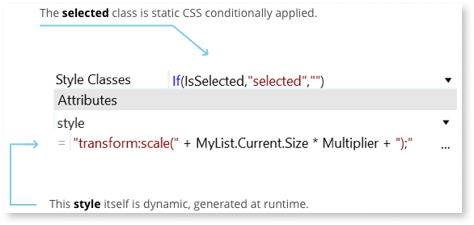
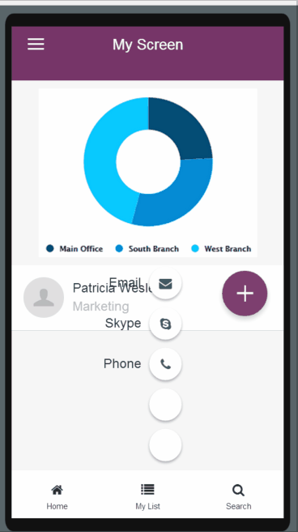
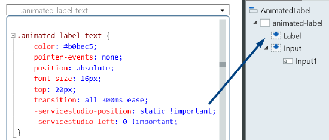
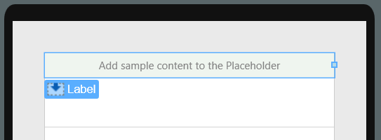
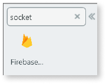
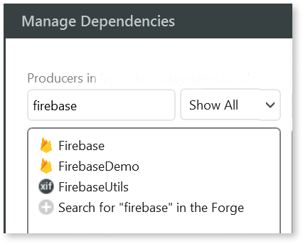
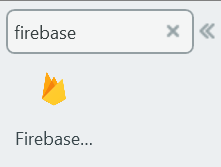

# The Complete Guide to Creating Components

This article guides you through the steps to create a reusable component in OutSystems. It includes recommendations, best practices, and information for common situations.

## Introduction

Components are one of the most important aspects of **low-code** [**platforms**](https://www.outsystems.com/platform/), which enable **reusability of code** and repositories of **component libraries**. As a result, developers can build high-quality app components and share them with others, boosting application development time and code fragmentation.

If you want to share your component in [OutSystems Forge](https://www.outsystems.com/forge/) and have it trusted by the OutSystems Curation team, make sure your component follows [all the requirements](https://success.outsystems.com/Support/Forge_Components/Forge_FAQs/Trusted_components_requirements) to be considered a Trusted component.

## What is a component?

A component is a **reusable object** that speeds up application creation and delivery. It can be either an application or a module that provides additional features. It should be **easy to use** and understand, and the focus should be **main or common use cases**.

After you create a component, there are three possible outcomes:

* It can **modularize your code**, to be reused within your application (Don't Repeat Yourself - [DRY](https://en.wikipedia.org/wiki/Don%27t_repeat_yourself)).

* It can act as an **infrastructure piece for your factory**, to be reused in more than one application.

* It can be **published to the Forge**, where it will serve several apps and developers.

The successful creation of a component encompasses:

* Deciding its **purpose**.

* Designing an **API** and **logic** that support the main scenarios.

* Defining the **presentation** by giving it the right names and icons, for example.

* Following a set of best practices that enhance the **experience of reuse** and **maintenance**.

* Making sure you cover **non-functional requirements**, such as performance, security, and scalability.

* Planning the **release** and let your component see the light of day.

The most common categories of OutSystems components, which you can [share in OutSystems Forge](https://success.outsystems.com/Support/Forge_Components/Forge_FAQs/Overview#What_kind_of_projects_can_I_share_or_use.3F), are the following:

* Integrations
* Device capabilities
* User Interface
* Functional libraries & utilities
* Development tools

See how you can [use a component made by the community](https://success.outsystems.com/Documentation/11/Getting_Started/Use_a_Forge_Component_Made_by_the_Community).

## Creating a component: Thinking it

Before you start building it, you need to think about your component. What do you want from your component? What **options** will it have? What should be the **default behavior** out of the box for a quick use? What are the most **important use cases**, and how will your component offer them upfront?

A **component is usually a set of blocks and actions** that needs to be distributed as a module and/or application. For example, if you want to modularize your own code, most likely your component will be a new block. However, if you're planning on feeding your factory or have a public release of your component, it will be inside an application, as a module.

If you're creating a component with only logic, consider creating an empty module, so it doesn't have any UI dependencies. This will make your component light and simpler to reuse, without additional dependencies.

On the other hand, if your component will have UI elements, start by creating a module with a template. This will provide you with a structure optimized for that purpose.

Consider your scenarios to build for success from the start.

## Creating a component: Building it

Upon defining the purpose of your component, you can start building it, by defining any relevant UI elements, actions, and logic.

Keep in mind that your components must fit into the [Architecture Canvas](https://success.outsystems.com/Support/Enterprise_Customers/Maintenance_and_Operations/Designing_the_architecture_of_your_OutSystems_applications) methodology used to build OutSystems applications.

### API design to offer the best options

There is no point in owning a great car if you don't know how to ride it. The same applies to a component. During implementation, keep in mind the developer experience and their skill set. As such:

* The API should be **small** and **simple** to understand. For example, instead of offering a 360-degree input for alignment, simply offer top, bottom, right and left.

* The API should focus on the **main use cases** and offer the best **defaults**. Other options can come through an extensibility mechanism.

* Consider **limiting the number of inputs** only to the ones strictly necessary for the component's **default behavior**.

One trick to expand your component configuration options without adding many **inputs** is to add only one more that receives all **extended options as JSON**. Make sure you explain the available JSON options on both the input and component descriptions.

If you have a lot of advanced scenarios, consider having a page dedicated to explaining those extensible options. In case you're publishing your component to the **Forge**, this can feed the Try Now option.

### Reusable CSS and JavaScript

#### Style Classes to simplify customization

Make sure you take advantage of expressions in the **Style Classes** property. This will generate code that changes the "class" attribute instead of using the "style" one, preventing unnecessary data on your DOM and **simplifying customization**. Keep in mind that everything that is static but conditional can be a CSS class, so use the inline style attribute only when you have a dynamic style. You can also consider leaving a comment explaining the math behind it.

#### CSS selectors for enhanced reusability

By only using classes in your CSS selectors, the reusability of your component will be limited because you will only be able to reference one instance of it, limiting its multiple usages on the same screen. Follow the steps below to create **CSS selectors in relation to a specific instance** of the component, instead of using only classes:

1. Add a wrapper div and set the "Name" property.

    

1. In the action, where you will have the JavaScript node with the selector, add an input parameter and set it as the MyBlockWrapper element ID.

    

1. Build your selector with a CSS class, related to the ID you passed as an input. In this example, the element where the CSS class exists is a child of the Wrapper element, but it could even be the same element.

    

    

#### Balancing limits and customization

When writing your code, especially CSS and JavaScript, be careful not to limit the developer. Keep in mind the **possibility of changing the UI and UX elements** of your component.

* **Avoid the "!important" CSS tag**. Even though this could be the right choice in some cases, you might not want to use it on a component because it will override the developer's custom CSS, therefore, limiting customization.

* **Avoid setting colors and buttons** as well, as they aren't easily overridden. If you have UI elements to trigger actions, like buttons, consider replacing them with placeholders, so that **developers can add their own UI elements** and decide what actions or logic to execute.

#### Creating for extensibility

When designing the component's API, consider if it provides enough mechanisms for the developer to **extend its functionality**. For example, a component that created JavaScript Objects should have a function that provides access to them. This way, **the developer can add features, creating a component that wraps another**.

### Using LifeCycle Events correctly (Mobile and Reactive Web Apps Only)

It's very important to understand the lifecycle of screens and blocks while developing a component to be able to control its data and behavior. Either to define default values for variables, or delete data that becomes irrelevant. Having complete knowledge of the lifecycle behavior allows you to **predict issues** and **optimize performance**.

Check the documentation for [Screen and Block Lifecycle Events](https://success.outsystems.com/Documentation/11/Developing_an_Application/Implement_Application_Logic/Screen_and_Block_Lifecycle_Events). Below, we'll detail the events more relevant for components.

#### OnInitialize to define variables' default values

Imagine that you have a screen with a local boolean variable with the default value `False`. After the screen logic is executed, the values change to `True`, and you navigate to another screen. In runtime, variables' values (defined as [model](https://en.wikipedia.org/wiki/Model%E2%80%93view%E2%80%93controller)) are saved, so that you can restore it when there's a Back Navigation also known as Previous Screen Navigation.

After this navigation, the variable will be `True`, but you might want to reset the screen state. So when you're using variables with default values always consider these navigation scenarios and if needed, assign the default values on the [OnInitialize](https://success.outsystems.com/Documentation/11/Developing_an_Application/Implement_Application_Logic/Screen_and_Block_Lifecycle_Events#on-initialize) event handler.

#### OnDestroy to prevent memory leaks

Some components create global variables, event listeners, or other data during their usage. Consider removing/deleting that data on the [OnDestroy](https://success.outsystems.com/Documentation/11/Developing_an_Application/Implement_Application_Logic/Screen_and_Block_Lifecycle_Events#on-destroy) event.

#### OnRender for rendering and data changes

Note that if your component includes UI, the [OnRender](https://success.outsystems.com/Documentation/11/Developing_an_Application/Implement_Application_Logic/Screen_and_Block_Lifecycle_Events#on-render) event is also important, because it runs each time the Screen or Block is rendered. For example, it runs whenever there is a data change on a screen.

### Configuring a good preview { #good-preview }

For a better development experience, ensuring a great preview inside Service Studio is key. Often, there are UI elements that have certain styles that we want to avoid when developing applications. For this, there are a set of preview improvements that can be done.

#### False conditions for better previews

When using an **If** widget with `False` as condition, developers are presented with a **friendly UI** that allows them to **hide placeholders** that occupy a large amount of UI space, for example, a side panel, or a bar.

You can also use it to display an image that replaces a runtime UI or adds UI to a component that doesn't have one. For example, a chart that is generated by JavaScript or a plugin block that propagates events.

Take a look at this example of the Silk Ui Mobile FloatingActions pattern. Its purpose is to provide a clickable circle that expands to provide extra options:

#### Service Studio CSS Tags for a better development experience

CSS properties prefixed with **-servicestudio-** can be used to **improve the preview and consequently the development experience**. This allows you to adapt the layout during development time. For example, when you have a placeholder with a position "absolute" that you want to keep static, so the developer can add content. Since the editor renders all CSS instructions, the elements might become inaccessible in the editor.

Using -servicestudio- tags helps developers set the values without compromising other features:

#### Sample content inside Placeholders

A [placeholder](https://success.outsystems.com/Documentation/11/Reference/OutSystems_Language/Mobile_Interfaces/Designing_Screens/Placeholder_Widget) should have sample content if it is directly connected to a behavior or structure. This way, the developer will know what the component is expecting in that placeholder. For example, both Silk UI Search and AnimatedLabel blocks have an input as sample because it is required for the block to work properly.

You should avoid using sample content for simple things like texts and images because it will only overwhelm and force the developer to delete them. Instead, add sample content only if it is mandatory or if it helps the developer.

 

 

### Non-functional requirements

#### Scalability

Keep in mind that you should build thinking of the future. So make sure that your component will be able to support **multiple blocks on the same screen**.

Consider **concurrency scenarios**. OutSystems already helps you with that in the background, keeping each block separated, but you will still need to be aware of actions triggered by the users. For example, several fast clicks on a button, triggering multiple calls to the server.

If the **component fetches data**, consider allowing the developer to **fetch it outside of the component** (for example, a screen), and provide that data (to the component) as an input parameter, instead of having the component fetch the data.

When using **external resources** (for example, external libraries, or JSON files), consider reusing them instead of fetching them again. For example, the System Action [RequireScript](https://success.outsystems.com/Documentation/11/Reference/OutSystems_APIs/System_Actions#Client_RequireScript) will use the cached file if you already requested it.

Read the complete description on how OutSystems handles scalability, in a way that's adjustable to specific requirements.

#### Security

When it comes to security, you need to consider that any device can be compromised. You should, therefore, focus on keeping your **data safe**.

Since everything you have on the **client side can be accessed and is more vulnerable**, make sure you **protect any sensitive data**. You can use this [plugin](https://www.outsystems.com/forge/component/1500/ciphered-local-storage-plugin/) to **cipher your data**.

For any server-side communication, you must ensure its safety by implementing **server-side validations**, especially permission roles.

When possible, enforce [HTTPS security](https://success.outsystems.com/Documentation/11/Developing_an_Application/Secure_the_Application/Secure_HTTP_Requests) on your screens, pages and integrations.

Read the complete description on [how OutSystems handles security](https://success.outsystems.com/Support/Security/Application_security_overview) with a set of pre-built features, to ensure the safety of your data during the entire lifecycle of mobile and web apps.

#### Performance

OutSystems ensures that there are no performance bottlenecks with **design-time validation**. When it generates the source code for applications, OutSystems optimizes code performance at all application layers.

Still, you'll do well in testing your component against more than just a few sample records. Set up a scenario as close as possible to the real one, and test your component against **probable conditions**.

Go the extra mile and consider **peaking the number of records or conditions**, or test scenarios with thousands of **concurrent users**. If your component is reaching the server, there might be performance impacts.

## Creating a component: Presenting it

**Reusability** and **simplicity** are key when creating a component. The component should be easy to understand, and it should focus on the main use cases. **Names**, **descriptions** and **visual cues**, such as **icons**, become fundamental to easily grasp the purpose of the component, and quickly know how to use it.

### Names and descriptions

**Names and descriptions help people understand what's the goal of your component and how to use it**. Names should be clear and clarify what the component is about. The public-facing parts of the component should have comprehensive, front-loaded and succinct descriptions.

To have a complete overview of the component, your description should include things such as: libraries URL, API version, and references to external resources.

Keep in mind these naming conventions in particular:

* Use **meaningful names** (for example, "Cropper", instead of "Cppr").
* Use [**PascalCase**](https://en.wikipedia.org/wiki/PascalCase) (for example, "FirebaseReceiver", instead of "Firebasereceiver").
* Use **event names that start with "On"** (for example, "OnReady", instead of "Ready").

Take a look at the complete list of OutSystems [Naming Conventions](https://success.outsystems.com/Documentation/Best_Practices/OutSystems_Platform_Best_Practices).

**Descriptions provide visual cues during development, enhancing that experience**. For example:

* Hover over **application dependencies** to see their description.
    
    

* Check a **module's description**, by hovering in the **Manage Dependencies** popup window.
    
    

* The **search box** allows you to search for the name and the description, Note that only components with an icon will appear in the toolbox, on the left.

    

    

### Icons for visual reference { #icons }

Visual programming environments have **graphical or iconic elements** to be used in an interactive way. Icons are important because developers actually see them in the development environment.

The first thing to keep in mind is that you should **use images that identify the component**. For example, the [Firebase Connector](https://www.outsystems.com/forge/component/1406/firebase/) has, as an icon, the Firebase company logo.

The second important thing to consider is that you must **use the same image from the Application level all the way to the Actions level**. This will provide consistency and allow developers to easily identify all your component pieces.

#### Application icons

Setting an application icon defines the **main icon of your component**. Users will relate everything that has this icon to the component. The application icon will be displayed throughout the component and its references. For example, it could even be used in the component's documentation.

Application icons should be in *.png* format to allow [transparencies](https://success.outsystems.com/Support/Release_Notes/10/Development_Environment/Development_Environment_10.0.405.0) and their size should be 1024 x 1024 px. Keep in mind the file size, as big files will slow down screen loading.

#### Module icons

Setting icons for the modules allows developers to relate the modules to your application in the Manage Dependencies window.

The size of module icons should be 1024 x 1024 px.

#### Block icons

Settings icons for blocks helps to easily identify to which component a UI element belongs to. So when you search for elements, you will be able to immediately see the blocks related to your component.

The size of block icons (.ico format) should be 32 x 32 px.

#### Action icons

Setting image icons for actions helps to easily identify to which component an action belongs to in a flow.

#### Client and Server Action icons

Service Studio makes a visual distinction between Client Actions and Server Actions. This visual cue helps users understand not only the context of the action but also the relevant scope.

For example, if you're working on a client side form for an offline application you'll want to use client side validations and avoid Server Actions. Your component should follow this distinction if possible and applicable.

If you're implementing both Client and Server Actions, consider using different styles of the same icon. OutSystems already provides you with the default icons for Client and Server Actions. If you want to change them, their size should be 32 x 32 px.

## Maintaining a component

You should **keep your code tidy and organized**. This is important for when you come back to it months later, and to make it easier for other developers to reuse it. When published in the [Forge](https://www.outsystems.com/forge/), it will be imperative that different users understand and work with the same code.

**Comment changes to code between versions**, so people can better understand what changed and why.

### Notes and comments

If you have logic-related code in your component that is not clear, then you should **add notes or comments explaining** its purpose. This is essential to make sure other developers can follow and improve the code. However, even if it's not that complex, you should always add a simple **label**, to make the code more understandable.

Have a look at this example with a JavaScript node:

Because different people have different mindsets, you should use Comments to explain complex code but also to sum it up. Consider how useful this is for a developer with limited knowledge of JavaScript, but still wants to understand the feature behind a JavaScript node.

## Sharing a component

If you think your component can help other developers, consider [sharing it in the Forge](https://success.outsystems.com/Support/Forge_Components/Forge_FAQs/Sharing_a_Project).

When sharing components in the Forge, take the following into account:

* Make sure you follow the [Forge components best practices](forge-components-best-practices.md).
* If you want to have your component trusted by the OutSystems Curation team, make sure your component follows [all the requirements](https://success.outsystems.com/Support/Forge_Components/Forge_FAQs/Trusted_components_requirements) to be considered a Trusted component.
