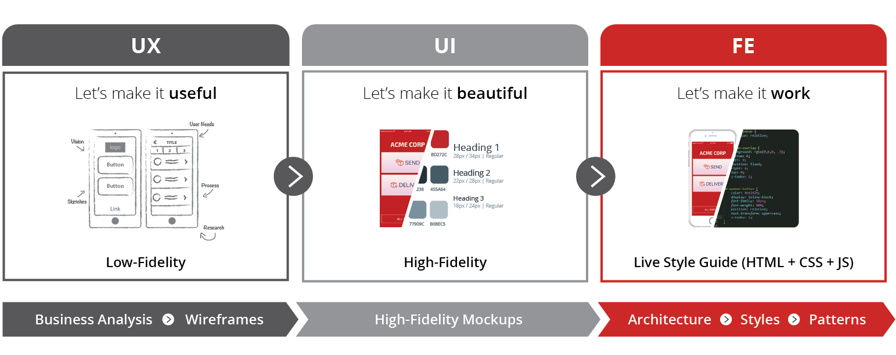

# フロントエンドジャーニー:  サンプルからコードまで

アプリケーションの開発はコアロジックや機能の実装の前に開始します。業務分析、テストプロトタイプ、再利用可能なパターンの設計の最初の段階は、確実に適切な調整を行い、開発チームがすばやく適切にスタートを切って開発を高速化できるようにするうえで重要です。
このジャーニーには3つの段階があります。

1.  まず初めは**UXコンセプト**です。ここでは、ビジネス要件をいくつかのワークフローやワイヤーフレームに変換しようと試みます。

1.  次に、**UI**設計に進みます。ここでは、アプリケーションの外観の全体像を適切に示す再現性の高いサンプルを作成します。

1.  次の手順は**フロントエンド開発**です。ここでは、サンプルをアプリケーション画面とユーザーインタラクションに変換します。

## UX/UI:  OutSystemsの設計

以下のセッションでは、要件の収集から、フロントエンド開発者の作業を高速化、ガイド、円滑化するライブスタイルガイド（フロントエンド開発段階のベースコンポーネント）の作成まで、このジャーニー全体のガイドを提供しています。

<iframe markdown="1" width="900" height="500"
src="https://www.youtube.com/embed/8ih45xQm8Gs">
</iframe>

## カスタムライブスタイルガイド

ライブスタイルガイドの設計は、再現性の高いサンプルからコードへの移行において不可欠な部分です。カスタムライブスタイルガイドの作成をすばやく適切に開始するには、OutSystems Forgeで入手可能な[OutSystems UI Style Guide](https://www.outsystems.com/forge/component-overview/5119/outsystems-ui-style-guide)が役立ちます。 
[//]: # (また、手順のチェックリストに従ってカスタムライブスタイルガイドを作成してください。)

* [OutSystems UI StyleGuide](https://www.outsystems.com/forge/component-overview/5119/outsystems-ui-style-guide)
[//]: # (* 独自LSGを作成するときのチェックリスト)

